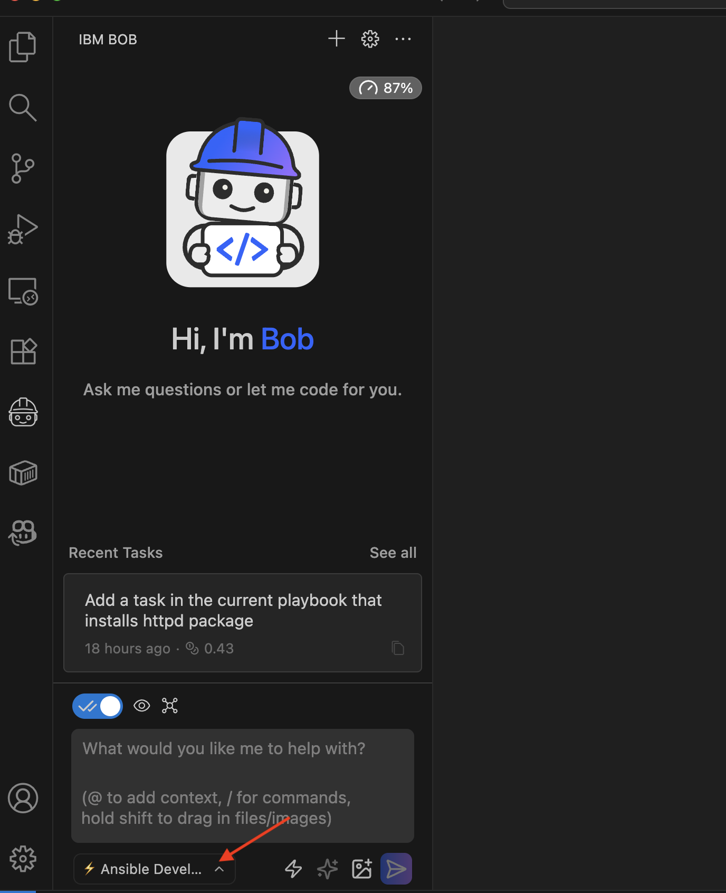

# Implementation Journey: [Ansible Playbook]

This demo shows how to use Bob to generate Ansible playbooks to install and configure a Web Server and properly configure the firewall.

Moreover, we'll use Bob to migrate the generated playbook into an Ansible Rule, making it reusable across other projects.

**Date added:** [02/13/2026]  
**Duration:** 10 min 
**Mode(s) Used:** Custom *Ansible Developer* mode

## Initial Goal

Deploy a Web Server using Ansible.

---

## Step-by-Step Process

### Step 1: Select Ansible Developer

To use Ansible Developer mode to create Ansible content, we created a custom Bob mode so Bob has the context for which manifests to generate.

Open the [input-documents/ansible-100](input-documents/ansible-100) in Bob, select the Ansible Developer mode.

**Bob's response:** 

Go to the bottom-left dropdown menu and select _Ansible Developer_ mode.

**Outcome:**

> [!NOTE]
> Take a look at the folder [input-documents/ansible-100/.bob](input-documents/ansible-100/.bob) to see the details of the custom mode and the mcp configuration.

### Step 3: Time for Prompting

At this point, we can start prompting Bob and check the [prompt-templates](prompt-templates/) folder for the prompts.

---

## Key Decisions

### Decision 1: Create a Custom Mode 

**Context:**

Bob needs to know which manifests need to be generated.

**Options Considered:** 

We should add in each prompt that the manifests are Ansible manifests.

**Choice Made:**

Implement a custom mode that indicates to Bob that he creates Ansible files.

**Rationale:** 

Creates a custom mode that sets Bob to generate Ansible files only, so when the user prompts to generate a deployment file, Bob knows it is an Ansible deployment file, not a Kubernetes deployment file.

### Decision 2: Provides an empty playbook file

**Context:** 

There are some global properties in playbooks, such as the playbook name and the hosts on which Ansible runs it.
To avoid adding an extra step to set this information, a minimal playbook is already defined at [input-documents/ansible-100/playbook.yaml](input-documents/ansible-100/playbook.yaml) with no tasks.

**Options Considered:** 

Let Bob produce this file, even though it is totally valid, the prompt would show some parameters that are not important for the example.

**Choice Made:** 

Put a simple playbook file so Bob can complete the required tasks.

**Rationale:**

Set any file with predefined information we already know beforehand to make prompting easier, especially at the initial stages.

---

### Challenge 1: Hallucinations with wide context

**Issue:** 

If the prompt was too generic, like: _Transform this application into an AI application_, the solution produced by Bob could be far from perfect, hallucinating or guessing too much.  

**Solution:** 

Implement all integrations with multiple prompts, executing each in turn.

**Learning:**

Always better to have multiple prompts rather than one containing all the information.

---

## Final Outcome

**What was achieved:**
- Ansible playbook to install `httpd` to defined hosts
- Configure Firewalld to accept only traffic from `httpd` port
- Redefines the playbook to migrate to an Ansible Rule

