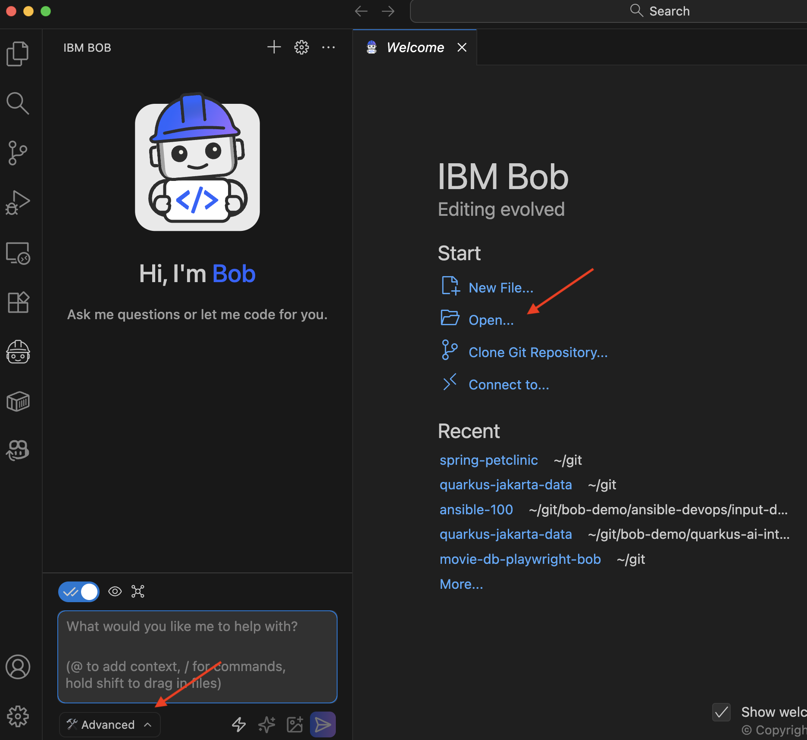

# Implementation Journey: [Architecture Tests with Taikai]

This demo shows how Bob can understand the architecture of a Java (Spring Boot) project and generate a Taikai JUnit test so the architecture of a legacy application is maintained across different teams.


**Date added:** [02/17/2026]  
**Duration:** 10 min 
**Mode(s) Used:** Advanced

## Initial Goal

Generate a test to validate the architecture of a legacy (or not) project.

---

## Step-by-Step Process

### Step 1: Clone the Petclinic project

Go to a terminal window, and clone the following project: https://github.com/spring-projects/spring-petclinic

```
git clone https://github.com/spring-projects/spring-petclinic.git
```

**Bob's response:**

**Outcome:**

Project cloned in the local directory

### Step 2: Select Advanced Mode

Open the cloned project into Bob and select _Advanced_ mode.

**Bob's response:** 

Go to the bottom-left dropdown menu and select _Advanced_ mode.

**Outcome:**




### Step 3: Time for Prompting

At this point, we can start prompting Bob and check the [prompt-templates](prompt-templates/) folder for the prompts.

---

### Challenge 1: Use the latest Taikai code

**Issue:** 

IBM Bob can be trained without the latest code for a specific library, leading to outdated code.

**Solution:** 

Use the `@` character followed by the project documentation link to let Bob know where the most up-to-date documentation of the project is.

**Learning:**

There are multiple ways to provide extra information to Bob. Rules are one way, and adding the URL of the documentation file is another.

### Challenge 2: Use the latest Version of Taikai

**Issue:** 

IBM Bob can be trained without the latest code for a specific library, leading to outdated code.
If the project documentation doesn't show the version number, Bob uses the one from his training, which might be too old.

**Solution:** 

When Bob previews the `pom.xml`, manually changes the pom version to the desired one, and then approves the change.

**Learning:**

There are multiple ways to provide extra information to Bob. Rules are one way; sometimes it is faster and easier to change them manually.

---

## Final Outcome

**What was achieved:**
- Bob understands code and the architecture decisions taken at development time.
- Creates a test so that further development continues following the same architecture.
- Provides a document explaining the architecture for the team.
