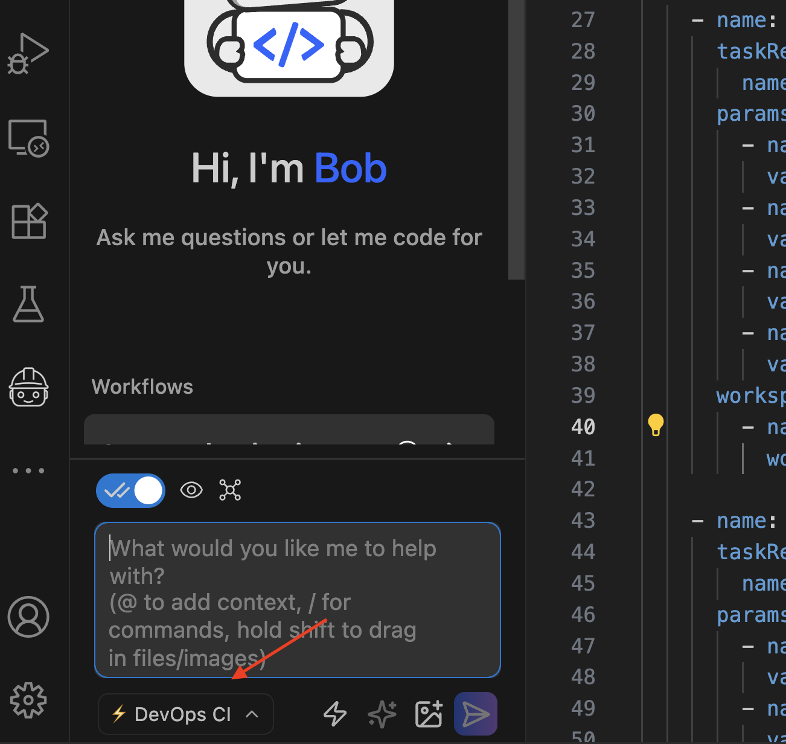

# Implementation Journey: [Tekton DevOps]

This demo shows how to use IBM Bob to generate a Continuous Integration pipeline for the [Tekton](https://tekton.dev/) framework. 

Bob reads the current project and the `AGENTS.md` file, then creates the pipeline following the instructions there.

**Date added:** [02/23/2026]  
**Duration:** 15 min 
**Mode(s) Used:** Custom *DevOps CI* mode

## Initial Goal

Create a Continuous Integration pipeline that clones a project, builds the application, creates and pushes a container image of the application, and runs a container security scan to find vulnerabilities, all using Tekton.

---

## Step-by-Step Process

### Step 1: Select DevOps CI mode

To generate Tekton stuff, select the DevOps CI mode. 

**Bob's response:** 

Go to the bottom-left dropdown menu and select _DevOps CI_ mode.

**Outcome:**

> [!NOTE]
> Take a look at the folder [input-documents/hello-world-tekton/.bob](input-documents/hello-world-tekton/.bob) to see the details of the custom mode.

### Step 2: Time for Prompting

At this point, we can start prompting Bob and check the [prompt-templates](prompt-templates/) folder for the prompts.

---

## Key Decisions

### Decision 1: Create an `AGENTS.md` file

**Context:**

Bob was trained on the concept of Continuous Integration and the most common steps used in the Continuous Integration pipeline. Still, most enterprises have custom pipelines, so we need to influence Bob to provide custom context.

**Options Considered:** 

Provide all this information in the prompt.

**Choice Made:**

Use the [AGENTS.md](input-documents/hello-world-tekton/AGENTS.md) file to provide a global overview of the pipeline to generate.
 
**Rationale:** 

Defining the entire pipeline in a single prompt is inefficient, unmaintainable, and not reusable across runs, projects, or teams.
It is better to define this in a shareable file, such as [AGENTS.md](input-documents/hello-world-tekton/AGENTS.md).

The `AGENTS.md` file's purpose is to provide overall project rules and workflows, making it ideal for defining the pipeline.

### Decision 2: Create skills for each task

**Context:** 

Every stage in Continuous Integration also has its own rules. For example, to build a container image, Bob can use Docker, Jib, Buildpacks, Buildah, or Kaniko. There are a lot of them, and as an organization, you might prefer one over others.

**Options Considered:** 

Let Bob produce the code without any guidelines, or make the prompt larger by specifying all the details.

Another option could be to implement a set of Bob rules in the `.bob` directory. In this case, we choose skills, as it is a standard way to work with code assistants.
Moreover, using skills is global and doesn't require you to create any custom mode to activate them, as Bob reads them automatically.

**Choice Made:** 

Create skills for each step, specifying all the details of each stage.

One possibility is using `AGENTS.md', but this file is more project-wide and offers an overview of the project.

**Rationale:**

`SKILLS.md` is a file used for explaining Specialized/Task-specific knowledge.
For this reason, skills are the best choice for providing more context rather than putting it in the `AGENTS.md` file.

The current developed skills are:

1. [secrets](input-documents/hello-world-tekton/skills/secrets/SKILL.md) - Generate the Kubernetes `Secret` and `ServiceAccount` to define the docker-registry data.
2. [build](input-documents/hello-world-tekton/skills/build/SKILL.md) - Generate a Tekton Task that clones a project, runs Maven to build the project, and uses buildh to build and push the container.
3. [security](input-documents/hello-world-tekton/skills/security/SKILL.md) - Generate a Tekton Task that uses Trivy to scan the generated container for vulnerabilities.
4. [pipeline](input-documents/hello-world-tekton/skills/pipeline/SKILL.md) — Generate a Tekton Pipeline that defines the workflow of the task execution.

---

### Challenge 1: Rules vs AGENTS and SKILLS

**Issue:** 

To provide context to Bob, there are two options: using Bob's *Rules* or `AGENTS.md` file, and in this case, we should choose one (even though both options can coexist).

**Solution:** 

Use `AGENTS.md` and `SKILLS.md` files to define the pipeline and the details of each stage.

**Learning:**

You should use `AGENTS.md` and `SKILLS.md` when the behaviour is a global rule of the organization applied to all projects, for example, all projects need to use Tekton as a CI engine.

*Rules* is something more project-specific; for example, for a specific project, you use Ansible to deploy the application. In this case, you place a rule in the application directory, but it is only activated when selecting the custom mode where you defined the rules.

Bob automatically reads the `AGENTS.md` file because it is tied to the project, not to any mode.
---

## Final Outcome

**What was achieved:**
- Quarkus application with a Tekton Continuous Integration pipeline.
- Build stage compiles the application, creates, and pushes the container image.
- Security Stage performs a security scan of the container image.
- Kubernetes resources to execute the pipeline.
